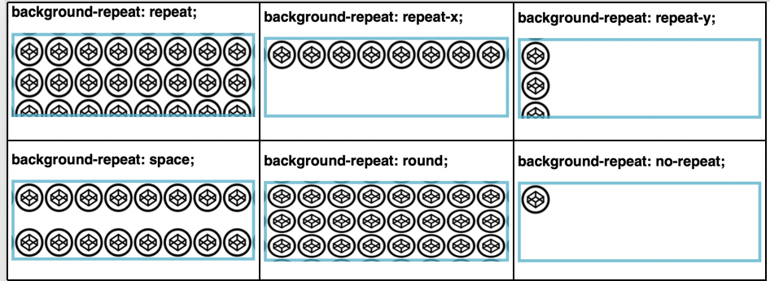
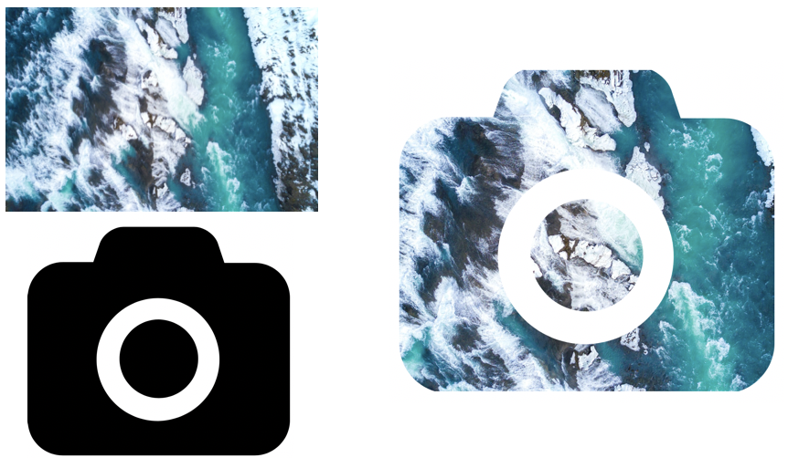

*This article shares some of my most pleasing moments learning CSS, and I hope it's the same for you as well.*

CSS is a Cascading Style Sheet and used to describe how HTML elements should display. CSS can not only provide colours, positions to the HTML elements, etc., but it can also create animations and enhance the web page. It's totally worth to know some useful tips and tricks which may help you create amazing web pages.

## 1. background-repeat

The <font color ="#905"> <span style="background-color:#e1e2e3">background-repeat</span></font> property sets if and how a background image will be repeated. It is used in conjunction with the <span style="background-color:#e1e2e3">background-image</span> property. We can repeat the background image along the horizontal, vertical axis or not repeat at all.<br>
*By default, a <span style="background-color:#e1e2e3">background-image</span> is repeated both vertically and horizontally.*

<b>Syntax</b>
```CSS
background-repeat: value; 
```
<br>
<b>Property Values </b>

<style>
.shadow {
    background: #F7F8F9;
    padding: 3px;
    margin: 10px 0;
    }
.space {
    margin-bottom: 25px!important;
}
table.data th {
    color: #000;
    padding: 8px 7px;
    text-align: left;
    font-size: 15px;
    background: #F8F8F8;
}
table.data th, table.data td {
    vertical-align: top;
    border: 1px solid #DCE3EB;
}
table.data td {
    color: #484848;
    padding: 5px 7px;
}
table {
    border-collapse: collapse;
    border-spacing: 0;
    -webkit-border-horizontal-spacing: 0px;
    -webkit-border-vertical-spacing: 0px;
}
</style>

 <div class="shadow space">
    <table class="data">
        <tr>
            <th style="width:85px;">Value</th>
            <th>Description</th>
        </tr>
        <tr>
            <td><code>repeat</code></td>
            <td>The background image will be repeated both vertically and horizontally.</td>
        </tr>
        <tr>
            <td><code>repeat-x</code></td>
            <td>The background image will be repeated horizontally only.</td>
        </tr>
        <tr>
            <td><code>repeat-y</code></td>
            <td>The background image will be repeated vertically only.</td>
        </tr>
        <tr>
            <td><code>space</code></td>
            <td>The background image will be repeated as many times as it will fit, but it is not clipped.</td>
        </tr><tr>
            <td><code>round</code></td>
            <td>The background image will stretch or shrink slightly to avoid clipping and to produce no gaps.</td>
        </tr>
		<tr>
            <td><code>no-repeat</code></td>
            <td>The background image will not be repeated.</td>
        </tr>
		<tr>
			<td><code>initial</code></td>
			<td>Sets this property to its default value.</td>
		</tr>
    </table>
</div>
<b>CSS Example</b>

```CSS
body {
    background-image: url("images.png");
    background-repeat: repeat;
}
```
<br>
<i>You can view the source code<a href="https://github.com/nimritees/webpage_practices/tree/master/cssTricks/background-repeat" target="_blank"> here</a></i>.

## 2. mask-image

*What is image masking?* <br>
Image masking is used to hide some portions of the image and to reveal some portions. CSS masking allows us to define a mask shape which is then applied to the image. Anything that come outside the mask shape is cut out, and the rest is displayed. It is pretty much works the same as masking in Photoshop. 

Let's say you want to use an image, but only want to show certain parts of it. You can achieve this using the <font color ="#905"><span style="background-color:#e1e2e3">mask-image</span></font> property in CSS. Masking can be performed using gradients and images.

*Anything that’s 100% black in the image mask with be completely visible, anything that’s 100% transparent will be completely hidden, and anything in-between will partially mask the image.*

### Masking using Gradients
- Linear Gradient Masking<br>
<b>Syntax</b>
```CSS
 mask-image:linear-gradient( [ <angle> | to [ left | right ] 
 || [ top | bottom ] ], <color>[ <percentage> | <length> | <transparent>] );
  ```
  
  <b>CSS Example </b>
```CSS
#masked{
-webkit-mask-image: linear-gradient(to bottom, transparent 5%, black 75%);
mask-image: linear-gradient(to bottom, transparent 5%, black 75%); 
}
```
In the below image, 1st part is the original image and second part is masked image with linear-gradient.


- Radial Gradient Masking<br>
<b>Syntax</b>
```CSS
mask-image:radial-gradient([[circle || <length>] [at <position>], |
[ellipse || [<length> | <percentage>]] [at <position>], |
[[circle | ellipse] || <extent-keyword>] [at <position>], |
at <position>,] <color>[ <percentage> | <length> | <transparent>])
```
<b>CSS Example</b>
```CSS
 #masked{
-webkit-mask-image: radial-gradient(ellipse 20% 90% at 27% 50%, black 40%, transparent 50%);
mask-image: radial-gradient(ellipse 20% 90% at 27% 50%, black 40%, transparent 50%);
 }
 ```
 In the below image, 1st part is the original image and second part is masked image with radial-gradient.


### Masking using Images

 <b>Syntax</b>
 ```CSS
 mask-image: url(mask.png);
 ```
 <b>CSS Example</b>
 ```CSS
 #masked{
 -webkit-mask-image: url(https://images.png);
 mask-image: url(https://images.png);
 }
 ```
 In the below example, a background image is used to mask an image of a camera out of it. 

 
 
<i>You can view the source code<a href="https://github.com/nimritees/webpage_practices/tree/master/cssTricks/mask-images" target="_blank"> here</a></i>.

## 3. Zoom on hover
A zoom effect on images when users hovers over them makes the web pages more attractive. This kind of effect can be used in galleries, selling products where you need to enlarge the image so that customers can have a better view.

The CSS <font color ="#905"><span style="background-color:#e1e2e3">transform</span></font> property is used for enlargemnet of images with your preffered scale amount. It provides a way to control animation speed when changing CSS properties.

 <b>Syntax</b>
 ```CSS
 transform: scale [transition-duration] [transition-timing-function] [transition-delay];
 ```

 <b>CSS Example</b>
 ```CSS
img:hover {
    transform: scale(1.1);
}
 ```
 In the below example, the image zooms out on hover.

 <div class=hover_apply>
    
</div>
<style>
.hover_apply img:hover {
    transform: scale(1.1);
}
</style>
<br>
<i>You can view the source code<a href="https://github.com/nimritees/webpage_practices/tree/master/cssTricks/zoom-on-hover" target="_blank"> here</a></i>.

## 4. scroll-snap-type

CSS <font color ="#905"> <span style="background-color:#e1e2e3">scroll-snap-type</span></font> property allows the developer to create well-controlled scroll experiences. This property can be used in the gallery section of the web-page.

Page scrolling in CSS is contolled by setting a <font color ="#905"> <span style="background-color:#e1e2e3">scroll-snap-type</span></font> property on a container element.  The scroll-snap-type decides the axis on which scrolling occours <b>x</b> or <b>y</b>.


<b>Syntax</b>
 ```CSS
 scroll-snap-type: [none | x | y] [mandatory | proximity];
 ```
*The `mandatory` means the browser has to snap to a snap point whenever the user stops scrolling.*
*The `proximity`  is less strict, it allows the browser to a snap point if it seems appropriate.* 


 <b>CSS Example</b>
 ```CSS
.y-scrolling {
      scroll-snap-type: y mandatory;
  }
 ```
 The below example shows, scroll-snap-type along Y axis with mandatory value. 

<body>
<div class="box y-scrolling">
    <div>Eat</div>
    <div>Sleep</div>
    <div>Code</div>
    <div>Repeat</div>
</div>
</body>
<style>
.box {
    display: flex;
    overflow: auto;
    flex: none;
    width: 43.5vw;
    height: 30vh;
    flex-flow: column nowrap;
  }
  .y-scrolling {
      scroll-snap-type: y mandatory;
  }
  .box > div {
    text-align: center;
    scroll-snap-align: center;
    flex: none;
    line-height: 3;
    font-size: 80px;
    width: 100%;
    height: 100%;
  }
  .box > div:nth-child(even) {
    background-color: #42f2f5;
  }
  .box > div:nth-child(odd) {
    background-color: rgb(234, 238, 17);
  }
</style>
<br>
<i>You can view the source code<a href="https://github.com/nimritees/webpage_practices/tree/master/cssTricks/snap-scroll-type" target="_blank"> here</a></i>.
