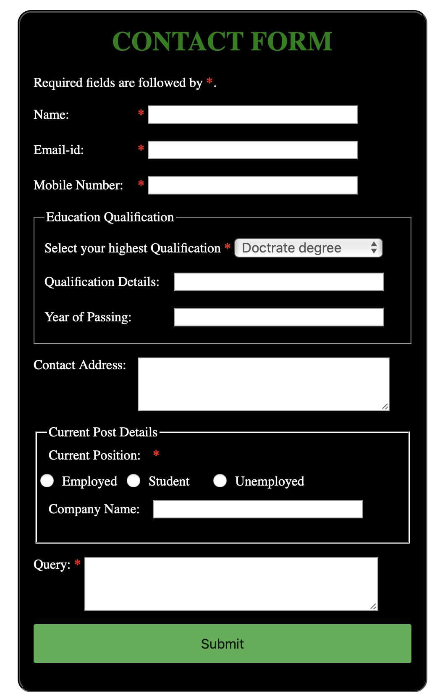

Forms are required, when you want to collect some data from the visitor. For example during user registration you collect information such as name, mobile number, email-address, etc depending upon your requirements.

There are different types of forms that can be created using diffrent languages and style. This blog mainly focuses on your first experience of creating a web form which includes designing a simple form, implementing it using the right HTML form controls and other HTML elements and adding some very simple styling using CSS.

### What do you need to know to create this form?

Basic understanding of HTML and CSS.

### Let's create a basic HTML form.

We will use the following HTML elements: `<form>`,`<label>`,`<input>`,`<textarea>`,`<button>`,`<fieldset>`

Before you go further, make a local copy of the simple <a href="https://github.com/nimritees/creatingForms/blob/master/basicForm/index.html" target="_blank">HTML form template</a> and save as yourfilename.html

All forms start with a `<form>` element, and ens with `</form>`.

In our form, the data entry portion contains wide range of HTML elements such as:

>`<input>` 
>The HTML `<input>` element is used to create different types of interactive controls for a form in oder to accept data from the user. The basic one's are:

| Command | Description | Example |
| --- | --- | --- |
| text | A single like text-field. | <input></input>
| radio | A radio button allows only a **single value** to be selcted out of set of predefined values. | <input type = "radio" name = "subject" value = "html"> HTML <input type = "radio" name = "subject" value = "css">CSS
| checkbox | A check box allowing **multiple values** to be selected out of predefined values. |<input type = "checkbox" name = "html" value = "on"> HTML <input type = "checkbox" name = "css" value = "on"> CSS
| submit | A button that is used to submits the form | <input type = "submit" name = "submit" value = "Submit" />

>`<label>` 
>The HTML `<label>` element represents a caption for elements of the form. 

### Points to remember
<ul>
<li type="circle">
Before starting to code, it is always important to take time and think about the form design. From a user experience point of view, it's imporant to remember that the bigger the form, the more you risk frustrating people and loosing users.
