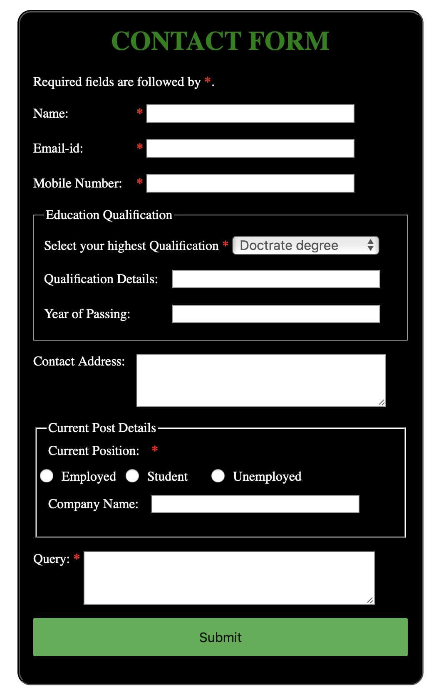

Forms are required, when you want to collect some data from the visitor. For example during user registration you collect information such as name, mobile number, email-address, etc depending upon the requirements.

There are different types of forms that can be created using diffrent languages and style. This blog mainly focuses on your first experience of creating a web form which includes designing a simple form, implementing it using the right HTML form controls and other HTML elements and adding some very simple styling using CSS. We'll talk about these subtopics in more detail, later in the blog.

### What do you need to know to create this form?

1. Basic understanding of [HTML](https://en.wikipedia.org/wiki/HTML).
2. Basic understanding of [CSS](https://en.wikipedia.org/wiki/Cascading_Style_Sheets).

### Let's create a basic HTML form.

We will use the following HTML elements: `<form>`,`<label>`,`<input>`,`<textarea>`,`<button>`,`<fieldset>`

Before you go further, make a local copy of the simple [HTML form template](https://github.com/nimritee/creatingForms/blob/master/basicForm/index.html) and save as yourfilename.html

### Points to remember
<ul>
<li type="circle">
Before starting to code, it is always important to take time and think about the form design. From a user experience point of view, it's imporant to remember that the bigger the form, the more you risk frustrating people and loosing users.
